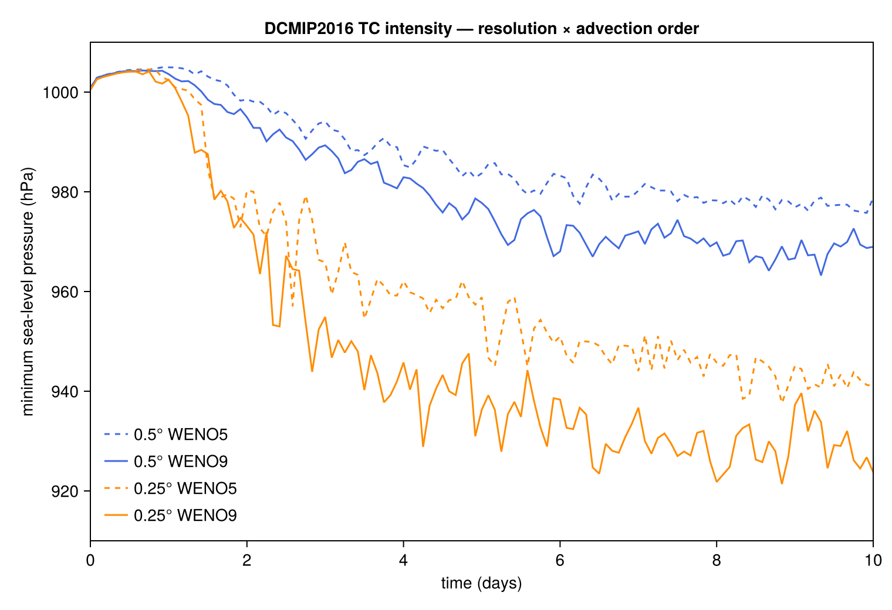
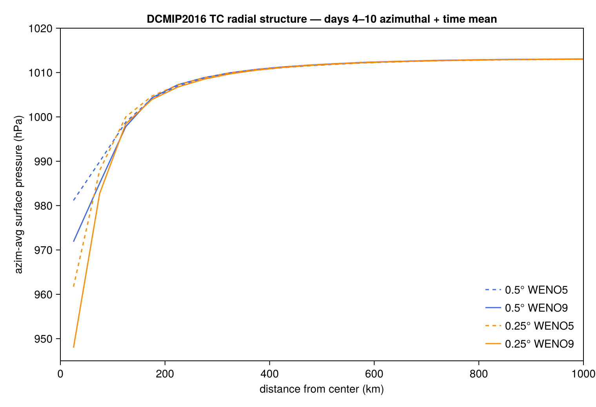
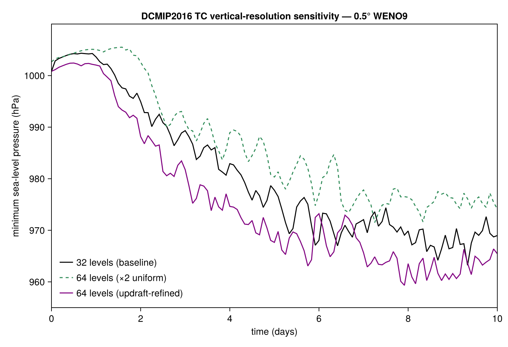
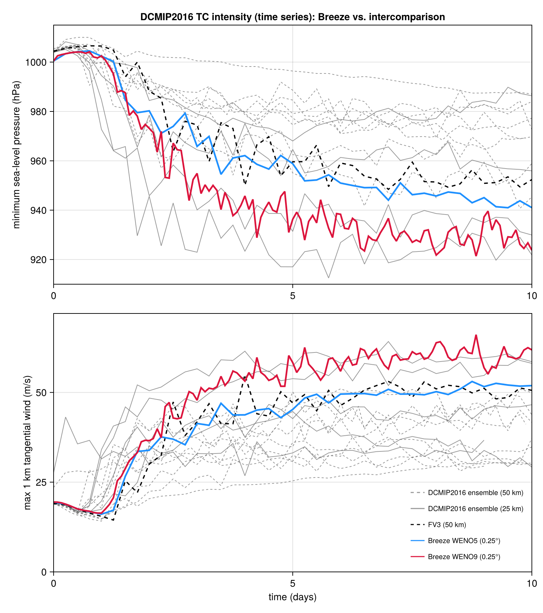
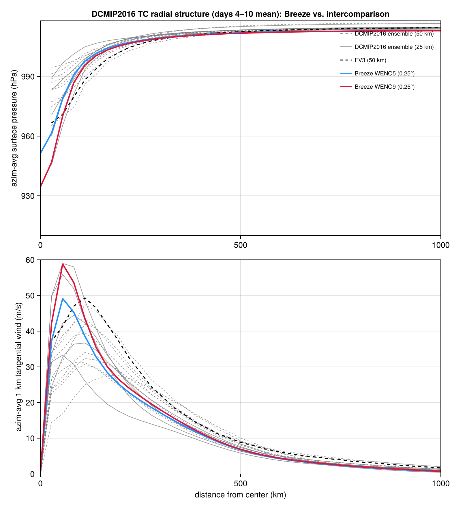
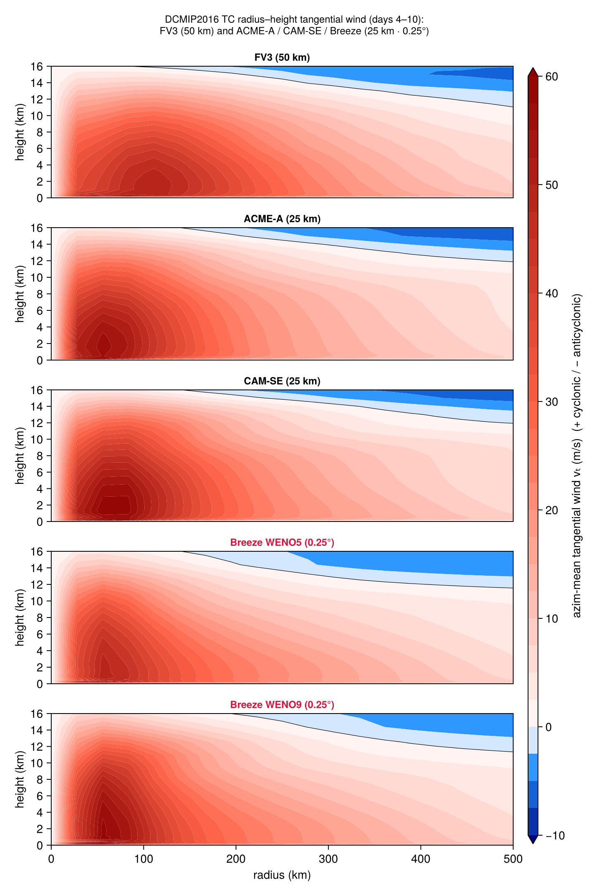

# DCMIP2016 tropical cyclone: resolution and advection intercomparison

This study quantifies how numerics — horizontal resolution, advection order, and
vertical level placement — control the intensification of the Reed–Jablonowski tropical
cyclone ([Reed & Jablonowski 2012](https://doi.org/10.1029/2011MS000099)), a standard
non-hydrostatic dynamical-core benchmark of the 2016 Dynamical Core Intercomparison
Project (DCMIP; [Ullrich et al. 2016](https://doi.org/10.5194/gmd-10-4477-2017),
[Willson et al. 2024](https://doi.org/10.5194/gmd-17-2493-2024)). Starting from
quiescent background conditions described by a moist tropical sounding, a weak, warm-core
analytical vortex intensifies into a tropical cyclone (TC) over ~10 days, driven entirely
by bulk surface enthalpy fluxes over a fixed 302.15 K sea surface.

The model configuration — initial vortex, background sounding, grid height, and the
complete Reed–Jablonowski "simple physics" (locally-defined wind-dependent surface drag
and boundary-layer mixing, plus Breeze's built-in `InstantaneousPrecipitation` for the
large-scale-condensation rain-out) — is assembled in `dcmip2016_tc.jl`. We hold those
parameters fixed and run two studies:

  * **Study 1**: horizontal resolution (**0.5°** vs **0.25°**) × advection order
    (**WENO5** vs **WENO9**).
  * **Study 2**: effective vertical resolution at fixed 0.5° WENO9: the 32-level baseline,
    a count-doubled 64-level grid, and a 64-level grid with levels clustered in the
    5–14 km updraft layer.

The TC intensity metrics of interest are the minimum sea-level pressure (MSP) and maximum
tangential wind at 1 km altitude (MWS). Time histories are shown along with the
mature-storm (days 4-10) azimuthally-averaged storm structure, compared against the
balanced TC reported by Willson et al. (2024, their Figs. 5 and 7).

> **Compute.** These are 10-day global runs and are **not** part of the docs/CI build. Run
> this script on a GPU node with **Julia ≥ 1.12** (`julia --project dcmip2016_tc_intercomparison.jl`);
> on Julia 1.11 the environment fails to instantiate (a Pkg resolver bug drops a build dependency
> from the manifest). The six unique configurations total ≈ 1.75 h on one H100 (0.5° runs ≈ 8 min,
> 0.25° runs ≈ 37 min). Each run is skipped if its `<prefix>_psfc.jld2` already exists, so the study
> resumes cheaply. The figures committed alongside this file were produced this way.

## Setup

````julia
using Oceananigans
using Oceananigans.Grids: λnodes, φnodes
using CairoMakie
using Printf

CairoMakie.activate!(type = "png")
````

Bring in the simulation generator.

````julia
include("dcmip2016_tc.jl")
````

### Diagnostics from the surface-pressure output

Each run writes its surface pressure (`<prefix>_psfc.jld2`) providing the intensity time
series and the radial structure.

`analyze_surface_pressure` reduces one run to (i) the MSP time series and (ii) the
days-4–10 azimuthally-averaged radial pressure profile, recentered on the instantaneous
eye (location of MSP) each frame so the storm's drift does not smear the average.

````julia
const EARTH_RADIUS = 6371220.0   # m, DCMIP2016 planet radius
great_circle_distance(λ1, φ1, λ2, φ2) =
    EARTH_RADIUS * acos(clamp(sind(φ1) * sind(φ2) + cosd(φ1) * cosd(φ2) * cosd(λ1 - λ2), -1, 1))

function analyze_surface_pressure(prefix; mature_days = 6, dr = 50e3, rmax = 1500e3)
    p_ts  = FieldTimeSeries("$(prefix)_psfc.jld2", "p")
    times = p_ts.times
    Nt    = length(times)
    grid  = p_ts.grid
    λ     = λnodes(grid, Center())
    φ     = φnodes(grid, Center())
    Nx, Ny = length(λ), length(φ)

    days = times ./ 86400
    msp  = [minimum(interior(p_ts[n], :, :, 1)) / 100 for n in 1:Nt]   # hPa

    edges = 0:dr:rmax
    rmid  = collect((edges[1:end-1] .+ edges[2:end]) ./ 2 ./ 1e3)      # bin centers (km)
    nb    = length(rmid)
    pacc  = zeros(nb)
    nframe = 0
    mature_s = mature_days * 86400.0
    for n in 1:Nt
        times[n] >= times[end] - mature_s || continue
        p2d = interior(p_ts[n], :, :, 1) ./ 100                        # hPa
        ie, je = Tuple(argmin(p2d))                                    # eye (i, j)
        λe, φe = λ[ie], φ[je]
        psum = zeros(nb); cnt = zeros(Int, nb)
        for i in 1:Nx, j in 1:Ny
            b = Int(fld(great_circle_distance(λe, φe, λ[i], φ[j]), dr)) + 1
            1 <= b <= nb || continue
            psum[b] += p2d[i, j]; cnt[b] += 1
        end
        pacc .+= psum ./ max.(cnt, 1)
        nframe += 1
    end
    pprof = pacc ./ nframe

    return (; days, msp, rmid, pprof, min_msp = minimum(msp))
end
````

Build and run a configuration only if its surface-pressure output is absent,
then reduce it to the per-run diagnostics.

````julia
function run_or_load(prefix; kwargs...)
    if isfile("$(prefix)_psfc.jld2")
        @info "reusing existing $(prefix)_psfc.jld2"
    else
        simulation = dcmip2016_tropical_cyclone_simulation(; output_prefix = prefix, save_fields = false, kwargs...)
        run!(simulation)
    end
    return analyze_surface_pressure(prefix)
end
````

## Study 1: horizontal resolution × advection order

Resolution is encoded by color (0.5° blue, 0.25° orange) and advection order by line
style (WENO5 dashed, WENO9 solid).

````julia
configs = [
    (; resolution = 0.5,  advection_order = 5, label = "0.5° WENO5",  color = :royalblue,  linestyle = :dash),
    (; resolution = 0.5,  advection_order = 9, label = "0.5° WENO9",  color = :royalblue,  linestyle = :solid),
    (; resolution = 0.25, advection_order = 5, label = "0.25° WENO5", color = :darkorange, linestyle = :dash),
    (; resolution = 0.25, advection_order = 9, label = "0.25° WENO9", color = :darkorange, linestyle = :solid),
]

config_prefix(cfg) = "dcmip_tc_$(cfg.resolution)deg_weno$(cfg.advection_order)"

results = Dict{String, Any}()
for cfg in configs
    @info "================  $(cfg.label)  ================"
    results[cfg.label] = run_or_load(config_prefix(cfg); cfg.resolution, cfg.advection_order)
end
````

### Intensity: minimum sea-level pressure

The headline comparison. Both refining the grid and raising the advection order deepen the
storm; resolution is the larger lever.

````julia
fig_intensity = Figure(size = (760, 520))
ax = Axis(fig_intensity[1, 1];
          xlabel = "time (days)", ylabel = "minimum sea-level pressure (hPa)",
          title = "DCMIP2016 TC intensity — resolution × advection order")
for cfg in configs
    r = results[cfg.label]
    lines!(ax, r.days, r.msp; color = cfg.color, linestyle = cfg.linestyle, label = cfg.label)
end
xlims!(ax, 0, 10); ylims!(ax, 910, 1010)
ax.xticks = 0:2:10; ax.yticks = 920:20:1000
ax.xgridvisible = false; ax.ygridvisible = false
axislegend(ax; position = :lb, framevisible = false)
save("dcmip_tc_intercomparison_intensity.png", fig_intensity)
````



### Mature-storm radial pressure structure (days 4–10)

Azimuthally- and time-averaged surface pressure about the eye. A deeper, tighter central
minimum indicates a more intense, better-resolved vortex; the 0.25° WENO9 run develops the
steepest pressure gradient through the eyewall.

````julia
fig_radial = Figure(size = (760, 520))
axr = Axis(fig_radial[1, 1];
           xlabel = "distance from center (km)", ylabel = "azim-avg surface pressure (hPa)",
           title = "DCMIP2016 TC radial structure — days 4–10 azimuthal + time mean")
for cfg in configs
    r = results[cfg.label]
    lines!(axr, r.rmid, r.pprof; color = cfg.color, linestyle = cfg.linestyle, label = cfg.label)
end
xlims!(axr, 0, 1000); ylims!(axr, 945, 1020)
axr.xticks = 0:200:1000; axr.yticks = 950:10:1020
axr.xgridvisible = false; axr.ygridvisible = false
axislegend(axr; position = :rb, framevisible = false)
save("dcmip_tc_intercomparison_radial.png", fig_radial)
````



### Study 1 summary

Minimum sea-level pressure reached over the 10-day run (deeper = more intense):

````julia
println("\n  configuration   |  min MSP (hPa)")
println("  ----------------|---------------")
for cfg in configs
    @printf("  %-14s  |  %7.1f\n", cfg.label, results[cfg.label].min_msp)
end
````

| resolution | WENO5 | WENO9 |
|------------|-------|-------|
| **0.5°**   | 975.8 hPa | 963.2 hPa |
| **0.25°**  | 937.6 hPa | **921.4 hPa** (deepest) |

The picture is consistent with the published DCMIP2016 intercomparison. Halving the grid
spacing from 0.5° to 0.25° deepens the storm by ~38 hPa (WENO5) to ~42 hPa (WENO9): the
0.5° grid (~55 km) barely resolves the eyewall, described by a radius of maximum wind
(RMW) ~50–75 km ≈ one grid cell, whereas 0.25° resolves it directly.

Raising the advection order from WENO5 to WENO9 lowers the
implicit numerical diffusion and deepens the storm by a further ~13 hPa at 0.5° and ~16 hPa
at 0.25°. The 0.25° WENO9 storm — the configuration `dcmip2016_tc.jl` runs by default —
reaches ≈ 921 hPa and develops the realistic, balanced radial structure documented by
Willson et al. (2024), placing Breeze within the spread of the 0.25° models in that
intercomparison (see [Comparison with Willson et al.](Comparison with Willson et al. (2024))).

## Study 2: vertical level configuration

Study 1 shows the 0.5° storm is *horizontally* resolution-limited. A natural question is
whether adding **vertical** levels recovers the intensity lost to the coarse horizontal
grid. We hold 0.5° WENO9 fixed and compare three 30 km-lid vertical grids:

  * **32 levels (baseline)** — the standard surface-refined grid (Δz₁ ≈ 64 m).
  * **64 levels (×2 uniform)** — the same stretching with twice the levels (Δz halved
    everywhere): tests whether raw *count* helps.
  * **64 levels (updraft-refined)** — the same Δz₁ but levels re-placed into the 5–14 km
    updraft layer (where the eyewall does its work) rather than piled into the boundary
    layer: tests whether *placement* helps. Motivated by FV3's near-dissipation-free
    Lagrangian vertical coordinate, which an Eulerian model can only approximate by putting
    levels where the vertical advection matters.

````julia
vertical_configs = [
    (; label = "32 levels (baseline)",        prefix = "dcmip_tc_0.5deg_weno9",        z_faces = stretched_z_faces(32, 4.2),  color = :royalblue, linestyle = :solid),
    (; label = "64 levels (×2 uniform)",      prefix = "dcmip_tc_0.5deg_weno9_nz64",   z_faces = stretched_z_faces(64, 4.2),  color = :seagreen,  linestyle = :dash),
    (; label = "64 levels (updraft-refined)", prefix = "dcmip_tc_0.5deg_weno9_vref64", z_faces = updraft_refined_z_faces(),   color = :red,       linestyle = :solid),
]

vresults = [run_or_load(vc.prefix; resolution = 0.5, advection_order = 9, z_faces = vc.z_faces)
            for vc in vertical_configs]

fig_vertical = Figure(size = (760, 520))
axv = Axis(fig_vertical[1, 1];
           xlabel = "time (days)", ylabel = "minimum sea-level pressure (hPa)",
           title = "DCMIP2016 TC vertical-resolution sensitivity — 0.5° WENO9")
for (vc, r) in zip(vertical_configs, vresults)
    lines!(axv, r.days, r.msp; color = vc.color, linestyle = vc.linestyle, label = vc.label)
end
xlims!(axv, 0, 10); ylims!(axv, 955, 1010)
axv.xticks = 0:2:10; axv.yticks = 960:10:1000
axv.xgridvisible = false; axv.ygridvisible = false
axislegend(axv; position = :lb, framevisible = false)
save("dcmip_tc_intercomparison_vertical.png", fig_vertical)
````



### Study 2 summary

````julia
println("\n  vertical grid              |  min MSP (hPa)")
println("  --------------------------|---------------")
for (vc, r) in zip(vertical_configs, vresults)
    @printf("  %-24s  |  %7.1f\n", vc.label, r.min_msp)
end
````

| vertical grid (0.5° WENO9) | min MSP |
|----------------------------|---------|
| 32 levels (baseline)       | 963.2 hPa |
| 64 levels (×2 uniform)     | 971.5 hPa (slightly weaker) |
| 64 levels (updraft-refined)| 959.3 hPa (slightly deeper) |

Vertical resolution is a **second-order** lever here. Doubling the level *count* uniformly
does not deepen the storm — it slightly weakens it (by ~8 hPa), because the extra levels
mostly pile into the near-surface layer (where the vertical velocity is small) while the
eyewall stays unresolved by the coarse *horizontal* grid; vertical levels cannot sharpen an
updraft the horizontal grid cannot represent. Re-placing the same number of levels into the
5–14 km updraft layer recovers ~4 hPa, in the FV3 direction, consistent with the
Lagrangian-vs-Eulerian vertical-dissipation reasoning — but the whole vertical swing
(~12 hPa) is small next to the ~38–42 hPa from horizontal resolution. What separates Breeze
from FV3 at equal (50 km) resolution is horizontal effective resolution (advection scheme /
dynamical core), not vertical spacing.

Two caveats inherited from the dynamical-core setup are worth noting when interpreting the
deepest runs: (i) the storm intensity at 0.25° is sensitive to the chaotic trajectory, so a
few hPa of run-to-run scatter is expected in the instantaneous minimum; and (ii) the 30 km
rigid lid has no absorbing sponge, leaving a weak gravity-wave reflection that does not
materially affect the surface intensity but should be kept in mind for upper-level
diagnostics.

## Comparison with Willson et al. (2024)

The point of the DCMIP2016 protocol is the multi-model intercomparison, so we place Breeze
directly against the [Willson et al. (2024)](https://doi.org/10.5194/gmd-17-2493-2024) ensemble,
reproducing their Figs. 5, 7, and 8. The published profiles (the nine models at 50 km, five also
at 25 km, processed with [`TempestExtremes` v2.1](https://github.com/ClimateGlobalChange/tempestextremes/tree/4caa80d53f4c39e1df08c33a3f10cea41643eb28)) are from the Willson Dryad archive in
`refdata/`. For a fair comparison Breeze is reduced through the same TempestExtremes
procedure. Radial profiles are based on a stable *sub-grid* storm center and ring-averaging
of the *tangential* wind on the published radial grid (0.25° great circle). These are
computed by `extract_willson_comparison_data.jl` and overlaid by `plot_willson_comparison.jl`.
The Breeze curves are WENO5 and WENO9 at 0.25°.

> **Reproduction.** Unlike the figures above (surface pressure only), these need the 3-D `(u,v)`
> field output and the reference data, so they are built by the companion scripts rather than by
> this run: download `refdata/` (see `refdata/DOWNLOAD.md`), run the WENO5/WENO9 0.25° cases with
> velocity output, then `julia extract_willson_comparison_data.jl <weno5_dir> <weno9_dir>`
> (writes `postproc/breeze_*_010.csv`) and `julia plot_willson_comparison.jl` (writes
> `postproc/willson_fig{5,7,8}.png`).

### Intensity time series — cf. Willson et al. (2024), Fig. 5

Minimum sea-level pressure (top) and maximum 1 km tangential wind (bottom) versus time.



Breeze WENO9 (0.25°) intensifies to ≈ 921 hPa with a peak azimuthal-mean 1 km tangential wind
≈ 59–66 m/s — the **intense end** of the ensemble, alongside CAM-SE; WENO5 is weaker and mid-pack.
FV3 (50 km, black) is the intense-group benchmark.

### Mature radial structure — cf. Willson et al. (2024), Fig. 7

Days-4–10 azimuthal-mean surface pressure (top) and 1 km tangential wind (bottom) versus radius.



Breeze lies on the ensemble's universal wind–pressure structure — the right wind for a given
central pressure — with WENO9 in the intense group. Its eyewall is notably **compact**, RMW
≈ 50–60 km versus FV3's ≈ 100 km — a genuine feature (the radius is set by the resolved dynamics,
not by the diagnostic).

### Radius–height tangential wind — cf. Willson et al. (2024), Fig. 8

Days-4–10 azimuthal-mean tangential-wind composites, one row per model: FV3 (50 km), then ACME-A
(the early version of E3SM), CAM-SE, Breeze-WENO5, and Breeze-WENO9 (0.25°). A cyclonic
(red) vortex below the tropopause is capped by the anticyclonic (blue) upper-level outflow.



Breeze reproduces the published intense models' structure — a deep cyclonic core capped by the
outflow anticyclone — with a tighter but smooth eyewall, consistent with its higher effective
resolution at fixed grid spacing.

---

*This page was generated using [Literate.jl](https://github.com/fredrikekre/Literate.jl).*
